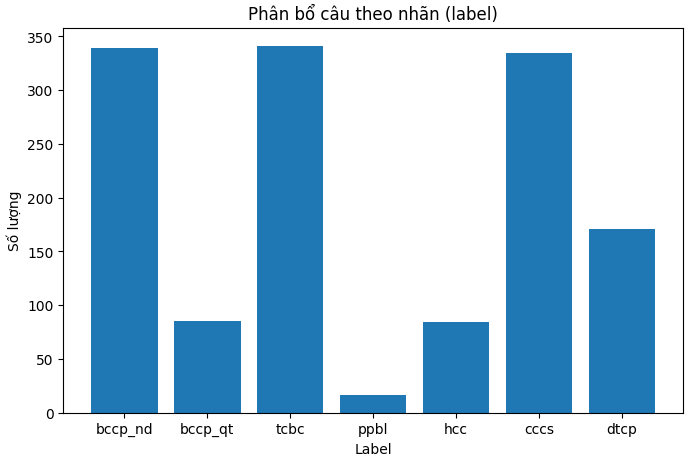
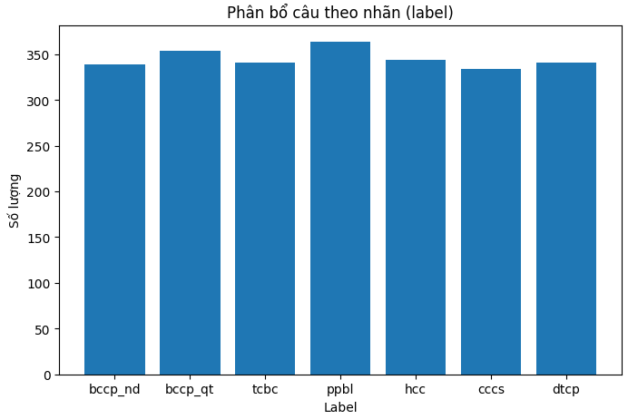
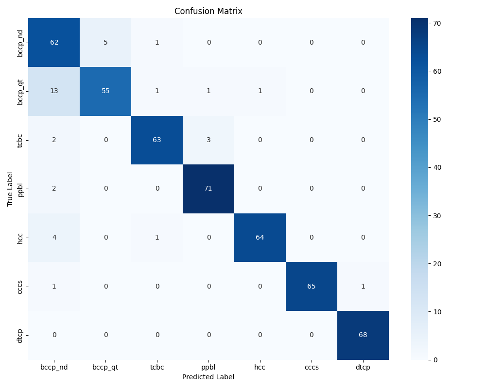

# 1. Mô tả bài toán và dữ liệu
**Mô tả**: Phân loại các câu hỏi nhập vào thành các nhãn bao gồm:
- Bưu Chính chuyển phát nội địa
- Bưu Chính chuyển phát quốc tế
- Tài chính Bưu chính
- Phân phối bán lẻ
- Hành chính công
- Cơ chế chính sách
- Doanh thu chi phí

**Tốc độ**: realtime

**Độ chính xác**: trên 95%

# 2. Mô tả dữ liệu
**Nguồn dữ liệu**: Thu thập từ các nguồn trong công việc hàng ngày

**Kích thước và phân bố**: 
```
{
    'bccp_nd': 339,
    'bccp_qt': 85,
    'tcbc': 341,
    'cccs': 334,
    'hcc': 84,
    'ppbl': 16,
    'dtcp': 170
}
```


**Tăng cường dữ liệu**:
Sử dụng các model LLM để bổ sung thêm dữ liệu còn thiếu để cân bằng dữ liệu các nhãn


**Làm sạch dữ liệu**:
Các kỹ thuật làm sạch bao gồm:
- Chuyển hết thành chữ viết thường
- Bỏ dấu câu, \t \n...

**Chia dữ liệu**:
- Sử dụng sklearn để chia dữ liệu theo tỷ lệ train:validation:test là 6:2:2
- Tỷ lệ được phân đều cho các nhãn

# 3. Kỹ thuật huấn luyện
- Sử dụng mô hình ```vinai/phobert-base``` để tiến hành fine-tune
- Fine-tune với 10 epoch, lấy epoch có loss thấp nhất, loss không giảm nữa thì dừng

# 4. Kết quả huấn luyện
## 4.1. Accuracy, F1
```
{
    'eval_loss': 0.3768310546875, 
    'eval_accuracy': 0.8840579710144928, 
    'eval_f1': 0.8841549458746446, 
    'eval_runtime': 1.232, 
    'eval_samples_per_second': 392.053, 
    'eval_steps_per_second': 25.163, 
    'epoch': 6.0
}
```
## 4.2. Classification Report
```
              precision    recall  f1-score   support

     bccp_nd     0.7381    0.9118    0.8158        68
     bccp_qt     0.9167    0.7746    0.8397        71
        tcbc     0.9545    0.9265    0.9403        68
        ppbl     0.9467    0.9726    0.9595        73
         hcc     0.9846    0.9275    0.9552        69
        cccs     1.0000    0.9701    0.9848        67
        dtcp     0.9855    1.0000    0.9927        68

    accuracy                         0.9256       484
   macro avg     0.9323    0.9262    0.9269       484
weighted avg     0.9323    0.9256    0.9266       484
```
## 4.3. Confusion Matrix


# 4. Đánh giá lỗi và nhầm lẫn
- Quá trình fine-tune gặp lỗi đánh nhãn từ 1 -> gây lỗi trong quá trình fine-tune vì giá trị index phải bắt đầu từ 0

# 5. Nhận xét về dữ liệu
- Dữ liệu thực mất cân bằng rất nhiều.
- Việc tăng cường dữ liệu chỉ mang tính "chống cháy"
- Cần cân bằng dữ liệu với dữ liệu thực tế, như vậy mô hình sẽ có độ chính xác cao hơn, các câu hỏi model gặp trong quá trình inference sát với tri thức model đã được học hơn.

# 6. Đề xuất cải tiến
- Bổ sung thêm dữ liệu